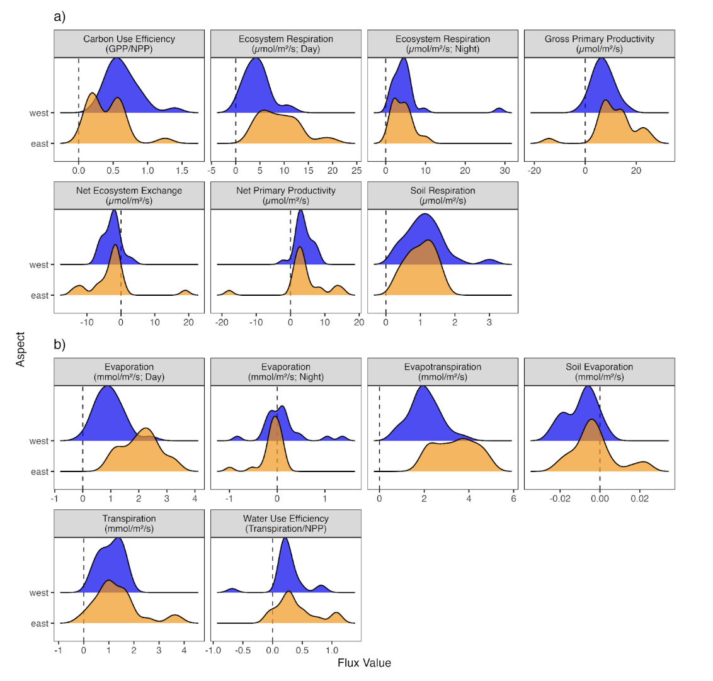
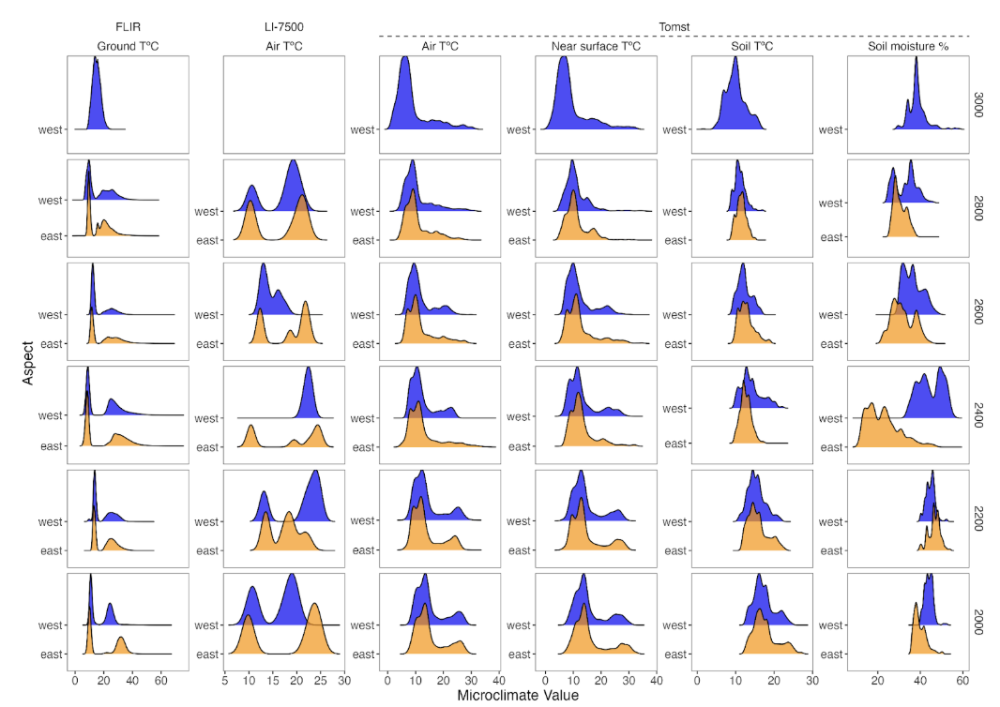

```{r setup, out.width='100%', include = FALSE}
knitr::opts_chunk$set(collapse = TRUE, 
                      comment = "#>", 
                      message = FALSE, 
                      warning = FALSE, 
                      eval = TRUE,
                      echo=FALSE)

```
# Readme file

This repository contains the cleaning code and reports on data from the PFTC6 Course in south-western Norway. 
This git repository is associated with the data paper: Halbritter et al. (2025). Plant traits and associated ecological data from Afromontane grasslands of Maloti-Drakensberg, South Africa. Scientific Data.
Here we describe the organization and structure of the data and describe each dataset in some detail.
For more details on the methods, data dictionaries, data validation and usage note see Halbritter et al. 2025.


## Summary

The Afromontane region harbors unique and ancient ecosystems high in endemisms, now under threat from land-use change, biological invasions and encroachment, and climate warming.
As part of an international Plant Functional Traits Course we collected comprehensive trait data in five sites along an elevation gradient from 2,000 - 2,800 m a.s.l. and in a climate warming experiment at 3,064 m a.s.l. in the Maloti-Drakensberg, South Africa.
We sampled 24,405 aboveground and 94 root traits from 173 vascular plant taxa paired with 11 other datasets reflecting vegetation and structure, leaf and ecosystem carbon and water fluxes, leaf hyperspectral images, and microclimatic and environmental data.
Our data provide the first recorded trait data for 47 vascular plant species and more than double the trait data coverage from the Maloti-Drakensberg (106% increase).
This study offers critical insights into plant and ecosystem functioning, provides a baseline for assessing impacts of environmental change, builds local competence, and aligns with similar data from China, Svalbard, Peru, and Norway.  

![*Figure 1 Conceptual figure of the study design and map of the site location in the Afromontane grasslands of the Maloti-Drakensberg escarpment. The study was carried out in the Free State and KwaZulu-Natal Provinces, South Africa. The study area follows an elevation gradient with five sites from 2,000-2,800 meters above sea level ( m a.s.l), with five 1.2 x 1.2 m plots each on the east- and west-facing aspects of the ridge per elevation. At the 3,000 m a.s.l. RangeX site, we sampled from 1 x 1 m plots in extant climate and in experimentally warmed plots inside open top chambers (OTCs). The inset map shows (a) the elevational profile of the Maloti-Drakensberg grasslands with the study site indicated, and (b) the location of the Maloti-Drakensberg within South Africa126,127. Data types and coverage available at each site are described in the methods sections. Red and green circles represent the burning and grazing history of the plots in 2023, the year the data were collected.*](figures/pftc7_revision_final_r2photopea.png)


## Data records

This data paper provides data related to plant functional traits, leaf and ecosystem carbon and water fluxes, leaf hyperspectral images, and microclimatic and environment. In 2023, we collected 13 datasets in six sites the conducted along an elevational gradient and in an OTC warming experiment in the Maloti-Drakensberg mountains in South Africa (Table 1).

The data  outputs consists of (i) plant community composition, (ii) vegetation height and structure, (iii) aboveground biomass, (iv) aboveground traits, (v) root traits, (vi) root biomass, (vii) leaf assimilation-temperature responses, (viii) leaf spectral imagery, (ix) vegetation thermal imaging, (x) ecosystem CO~2~ and H~2~O fluxes, (xi) microclimate, (xii) soil texture and nutrients, and (xiii) geodiversity and microtopography. 


![*Table 1 Description and location of the datasets. This table summarises information on dataset number, response variable(s), number of observations, temporal range of the data, and location of the primary data, the final published data, and the code for extracting and cleaning data from the primary data. Superscripts refer to atotal number of observations in the data (i.e., data points), and bnumber of taxa for which we have data. Note that chemical trait analyses are still in progress, and the planned final numbers are 8,574 measurements from 60 species. The OSF repository will be updated to include these measurements.*](figures/Table_1.png)


### Data organization and structure

The final clean data files are available on OSF^43^.
All files are named using the following  naming structure: nr_PFTC7_clean_studysystem_variable_year(s).csv.
The nr refers to the roman dataset number in Table 1; study system refers to the Elevation Gradient or Warming Experiment; the variable corresponds to the response variable using the terminology in Table 1.
All datasets are structured similarly, sharing some common variables including year, date, site_id, elevation_m_asl, aspect, and plot_id, and specific variables that are unique to each dataset (Figure 2).
The shared variables can be used to link different datasets, for example to combine them for specific analysis (bold letters in Figure 2).

The code necessary to access the raw data and produce cleaned datasets, along with explanations of the various data cleaning steps, issues, and outcomes, are available in open GitHub repositories, with versioned copies archived in Zenodo^44-50^.
The raw data files are also available at Open Science Framework (OSF)^43^ and are stored in a folder called “raw_data”.
In this folder there is a separate folder for each dataset containing several raw data files.
The folder is named using the roman letter corresponding to Table 1.
The Usage Notes section in this paper summarises the data accuracy and data cleaning procedures, including explanations of and advice on how to deal with various comments and flags in the data, caveats regarding data quality, and our advice on 'best practice' data usage.
The reader is referred to the code and the detailed coding, data cleaning, and data accuracy comments and the associated raw and cleaned data and metadata tables below for further information.
The reader is referred to the code and the detailed coding, data cleaning, and data accuracy comments and the associated raw and cleaned data and metadata tables below for further information.

![*Figure 2 Data structure for the PFTC7 traits campaign. Boxes represent the data tables for taxa and species composition (dataset i), vegetation height and structure (dataset ii) aboveground biomass (dataset iii), abovegound traits (dataset iv), root traits (dataset iv), root biomass (dataset vi), leaf assimilation-temperature responses (dataset vii), leaf spectral imaging (dataset viii), vegetation thermal imaging (dataset ix), ecosystem fluxes (dataset x), microclimate (dataset xi), soil texture and nutrients (dataset xii), and geodiversity and microtopography (dataset xiii).  Names of individual data tables are given in the coloured title area, and a selection of the main variables available within tables in the internal lists. The lines linking boxes exemplify links using species as keys across tables;, note that all bold variables are shared between several tables and can be used as keys to join them.*](other_code/PFTC7_database.png)

 
### Dataset i: Plant species composition

The plant community dataset contains vascular plant cover, fertility, and associated metadata for 173 taxa in 60 plots.
Along the gradient, we registered 153 taxa in 50 plots, with a mean species richness per plot across all sites is 20.8 ± 0.9 species (mean ± SE).
The mean species richness varies across sites, being highest at mid-elevation with 26.6 ± 1.2, at 2,600 m a.s.l., compared to, for example, 17.2 ± 0.8 at 2,000 m a.sl.
Species richness was similar on the eastern and western aspects.
*Themeda triandra* (Poaceae), *Ficinia cinnamomoea* (Cyperaceae), and *Tenaxia disticha* (Poaceae) were dominant species along the elevation gradient and had the highest total cover.
Helichrysum and Senecio species were the most abundant forbs.
The warming experiment had a total of 39 taxa in 10 plots.
The mean species richness for ambient plots is 17.4 ± 1.03 and 13.8 ± 2.03 in the warmed plots.
Thirty eight percent of vascular plants encountered during the survey were fertile.

Species composition changed gradually with elevation, up to 2,800 m a.s.l., while the species composition at the RangeX site at 3,000 m a.s.l. was distinct.
The species composition also differed between the east and west facing slopes, indicated by a separation along in NMDS space (Figure 3).
At the highest site, the warmed plots are somewhat closer to the lower-elevation sites in NMDS space.

![*Figure 3 Patterns in community composition. Non-metric multidimensional scaling (NMDS) ordination showing variation in community composition between plots across elevation, aspects and, at the highest elevation site, warming treatments. The NMDS is based on 173 taxa and has a stress value of 0.134. For the five lowest sites (2,000-2,800 m a.s.l), the shape of each symbol indicates whether the plot was east or west facing. For the highest site, the shape indicates whether the plot was warmed with an OTC or a control plot.*](figures/Figure_3_ordination.png)


### Dataset ii: Vegetation height and structure

This dataset contains the mean height of vegetation in 59 plots and the percentage of the rock covered by bare soil, rock, moss, and lichens.
The mean height of vegetation across all sites was 15.5 cm.
Vegetation was tallest at 2,800 m a.s.l. (22 cm) and shortest at 2,000 m a.s.l. (10.9 cm).
The cover of moss (< 0.5%), lichen (< 0.6%), and rocks (< 4%) were generally low. The cover of bare soil ranged between 2.5 and 26% and was highest at the lowest site and lowest at 2,800 m a.s.l.


### Dataset iii: Aboveground biomass

This dataset contains biomass data from 50 plots (all plots from sites 1-5) and is presented as biomass per 1.44 m^2^ corresponding to the plot size (1.2 m x 1.2 m).
Biomass increased with elevation from 210 g at the lowest site to 749 g at 2,800 m a.s.l., with the exception of the eastern side at 2,400 m a.s.l. that had the highest biomass (1,064 g).


### Dataset iv: Aboveground traits

Aboveground trait data are used to link all the different data and approaches in this study (Table 1), and the aboveground trait dataset therefore includes leaves sampled based on the plot-level trait sampling protocol along the elevation gradient and in the RangeX site as described above, and additional leaves as needed to augment other datasets.
Most of these additional leaves are sampled within sites but outside study plots (Figure 1) and are given a plot ID of 0 in the aboveground trait dataset along the gradient.
The exception is leaf traits collated to match the root trait data, which are reported as part of the root trait dataset to facilitate linking aboveground and root traits from individual plants sampled using the root trait protocol (dataset v).

For the elevation gradient, we measured physical and structural traits (plant height, wet and dry mass, leaf area, leaf thickness, specific leaf area [SLA], and leaf dry matter content [LDMC]) for 3,038 leaf samples from 156 taxa across all sites and treatments.
Of these, 2,889 leaves were sampled using the plot-level traits protocol, of which 966 were also measured for leaf spectral imagery (dataset viii).
An additional 147 leaves originate from the leaf assimilation-temperature response sampling (dataset vii).
These leaves resulted in 21,921 trait observations (Table 1).
There are a similar number of leaves from both aspects (east: 1,528, west: 1,578), with some variation in leaf numbers across elevation (2,000 m a.s.l.: 622; 2,200 m a.s.l.: 733; 2,400 m a.s.l.: 585; 2,600 m a.s.l.: 680; 2,800 m a.s.l.: 490).
Along the elevational gradient, unweighted trait distributions show that traits related to size, such as plant height, mass, and leaf area tend to increase with elevation, with the smallest values on low elevations (Figure 4a).

In the warming experiment, we measured physical and structural traits (plant height, wet and dry mass, leaf area, leaf thickness, specific leaf area [SLA], and leaf dry matter content [LDMC]) for 349 leaf samples from 43 taxa across both warming treatments, for a total of 2,494 trait observations.

We aimed to measure the most abundant species with a cumulative cover of at least 80% in all plots (based on dataset i—plant species composition).
In the elevation gradient plots, 86% of respective plots have at least 80% of all plot-level trait measurements, making this dataset useful for exploring intraspecific trait variation.

![*Figure 4 Trait distributions along the elevational gradient. Distributions of trait data (unweighted values) for each site (and aspect) along the 2,000 - 2,800 m a.s.l in the Maloti-Drakensberg mountains, South Africa. When available, the plots are based on all sampled leaves using local trait values for each plot. (a) The aboveground traits are plant height and reproductive height and leaf wet mass, dry mass, area, thickness, specific leaf area (SLA), and leaf dry matter content (LDMC). The size traits (height, reproductive height, mass, length, area, and thickness) are log-transformed. (b) The root traits mean root diameter (RD), branching intensity (BI), specific root length (SRL), root tissue density (RTD), and root dry matter content (RDMC). One value >0.5 g cm-3 for RTD was removed as an outlier for display purposes.*](figures/Figure_4_traits.png)


### Dataset v: Root traits

We measured root and aboveground functional traits of 94 individuals from 5 taxa at the four sites between 2,200 - 2,800 m a.s.l (Figure 1).
Overall mean RD, BI, SRL, RTD, RDMC (mean ± SD) values are 0.285 ± 0.035 mm, 0.384 ± 0.084 mm^-1^, 73.5 ± 32.2 m g^-1^, and 0.213 ± 0.115 g cm^-3^, and 360 ± 112 mg g^-1^, respectively.
RD and BI values did not vary across the elevation gradient, with average values ranging from 0.28 to 0.29 mm and 0.37 to 0.40 mm^-1^, respectively (Figure 4b).
Mean SRL values ranged from 64.08 to 85.43 m g^-1^, with the highest value at 2,600 m a.s.l.
RTD values ranged from 0.18 to 0.25 g cm^-3^, with the lowest value at 2,600 m a.s.l.
RDMC average values ranging from 326.76 to 391.71 mg g^-1^, with the highest average value at 2200 m.a.s.l. 


### Dataset vi: Root biomass mapping

We measured the position, depth, amplitude and pixel count of 999 root detections along two transects at each of four sites (2,000, 2,200, 2,400, 2,600 m) on western aspects (dataset vi-a, Figure 1).
We took a total of 80 soil samples at 80 of the GPR root detections across all sites. 

At the end of the field campaign, the GPR was also run over the vegetation plots, taking two measurements: detect and marker (dataset vi-b).
We measured the position, depth, amplitude, and pixel count of 745 root detections, and we marked the beginning and end of each plot at each site to correlate the plot vegetation data with our root detections. 


### Dataset vii: Leaf assimilation-temperature responses

We measured 127 raw assimilation-temperature curves, resulting in 96 clean curves for nine species.
​Multimodal curves, curves with poor model fits (r2 ≤ 0.9), and curves where the fitted optimal temperature was within 3 ॰C of the minimum or maximum observed leaf temperature were discarded.


### Dataset viii: Leaf spectral imagery

In total, we measured leaf spectral imagery for 1,089 leaves from 56 species (34 genera) across all sites (nsite 1= 181, nsite 2= 263, nsite 3= 214, nsite 4= 201, nsite 5= 229).
First, any samples from dataset iv that were large enough to fill the measurement area (~1cm radius) were measured for spectral imagery prior to functional trait measurements (n = 211) to obtain measurements across as many genera as possible (Figure 6a).
Second, additional samples were collected for three focal species to allow exploration of variation at the intraspecific level, *Helichrysum ecklonis* ( ntotal = 229), *Helichrysum pallidum* (ntotal = 234), and *Senecio glaberrimus* (ntotal = 288) (Figure 6b).
Third, all samples with leaf assimilation-temperature response measurements (dataset vii) were also paired with hyperspectral reflectance measurements after gas exchange was performed (n = 127).


### Dataset ix: Vegetation thermal imaging

We recorded a diurnal time series of thermal images from the east and west aspects of sites 1 and 5, capturing data from sunrise to sunset at each of the four site-aspect combinations (Figure 1).
The camera was positioned to include the species of interest from the assimilation-temperature response dataset at each site (dataset vii).
Each thermal image is paired with a visual photograph to facilitate region of interest selection.
The camera setup includes a black reference plate for temperature calibration, and post-field analysis involves selecting regions of interest for the plants in each image.
The time series data contain minor gaps due to battery changes during the measurement periods. 


### Dataset x: Ecosystem CO~2~ and H~2~O fluxes

The clean flux dataset contains 392 plot level flux measurements, consisting of 194 CO~2~ fluxes (45 NEE, 50 daytime respiration, 49 nighttime respiration and 50 soil respiration measurements) and 198 H~2~O fluxes (50 evapotranspiration, 50 daytime evaporation, 48 nighttime evaporation and 50 soil evaporation measurements) of sufficient quality.
From these, we calculated 135 carbon fluxes (45 CUE, 45 GPP, 45 NPP) and 145 water fluxes (50 daytime evaporation, 50 transpiration, and 45 WUE).
These data are not standardized for biomass or temperature.

Interestingly, we do not observe a strong correlation of any flux with elevation (correlation consistently < 0.3).
However, we found marked differences between the west and east-facing slopes (Figure 6).
For example, we found considerably smaller variability in NEE at west-exposed slopes (2.63±2.48 µmols m^-2^ s^-1^) compared to sites with an east aspect (2.90±6.35 µmols m^-2^ s^-1^).
Similarly, we found less daytime respiration in sites with a west aspect (-4.38±2.54 µmols m^-2^ s^-1^) compared to sites with an east aspect (-9.04±4.3 µmols m^-2^ s^-1^).
Moreover, we observed a clear difference in evaporation between east and west-exposed sites, with a higher evaporation at east-facing slopes (2.07±0.66 mmol m^-2^ s^-1^ east, 0.953±0.50 mmol m^-2^ s^-1^ west aspect). 




### Dataset xi: Microclimate and habitat variables

The microclimate data contains measurements of air temperature (32,634 measurements), near surface air temperature (25,220), ground temperature (3,912,235), soil temperature (25,220), and soil moisture (25,220) for a total of 4,020,529 observations (Figure 7). 




### Dataset xii: Soil texture and nutrients

The soil texture and chemical dataset (dataset xii) has 400 observations of 8 soil variables from all plots along the elevational gradient.
CEC had six missing observations, due to insufficient soil remaining for these tests.
The low elevation site (2,000 m a.s.l) showed the lowest values for total P, N and C, CEC, sand and stone (%).
There were mid-elevation (2,400 m a.s.l) peaks for total N (0.59 ± 0.05%) and total C (10.11 ± 0.86%), while CEC peaked at 2,200 m a.s.l.
Overall, the higher elevation sites (2,400 m) had greater sand content, higher pH levels, and greater nutrient availability than low elevation sites.
At the same time, the low elevation site had the greatest clay and silt content.  


### Dataset xiii: Geodiversity and microtopography

The geodiversity and microtopography data (dataset xiii) contains 450 observations of 12 soil variables from all plots along the elevational gradient. 


### Hwo to reproduce the data cleaning

The cleaning code in this repository is based on a reproducible workflow using a [targets pipeline](https://books.ropensci.org/targets/) in a [renv environment](https://rstudio.github.io/renv/articles/renv.html).

To reproduce the data cleaning, use the following steps:

1. Clone this GitHub repository to your local machine.

2. Run `renv::restore()` to reproduce the environment and download and install all R packages that are needed.

3. Open the `run.R` file and run `library(targets)` and `targets::tar_make()` to reproduce the code.
The cleaning code is located in the R/Functions folder.


## References

43.	Halbritter, A.H. , and the PFTC7 Team. OSF data respository for PFTC7 - PFTCourses plant functional traits, carbon fluxes, temperatures, and spectral data from an elevational gradient and a ITEX warming experiment in the Drakensberg Mountains in South Africa.

44.	Halbritter, A.H., and PFTC7 Data Team. GitHub repository for PFTC7 - PFTCourses plant functional traits, carbon fluxes, temperatures, and spectral data from an elevational gradient and a ITEX warming experiment in the Drakensberg Mountains in South Africa.

45.	White, J. GitHub repository PFTC7 - Belowground trait and soil data.

46.	Michaletz, S., Cross, M. , and the PFTC7 Team. GitHub repository PFTC7 - download and cleaning leaf assimilation-temperature responses.

47.	Bison, N., and Leaf Spectral Team. GitHub repository for PFTC7 - PFTC Courses hyperspectral data from an elevational gradient in the Drakensberg Mountains in South Africa.

48.	Cross, M. , and the PFTC7 Team. PFTC7 - PFTC Courses Thermal Imaging Data from an elevational gradient in the Drakensberg Mountains in South Africa.

49.	Garen, J. & Michaeletz, S. GitHub repository for thermal image analysis (PFTC6 and 7). https://github.com/MichaletzLab/thermal_analysis_pftc6 (2024).

50.	Dawson, H.R., and Carbon Flux Team. GitHub repository for PFTC7 - PFTC Courses carbon fluxes data from an elevational gradient in the Drakensberg Mountains in South Africa.
